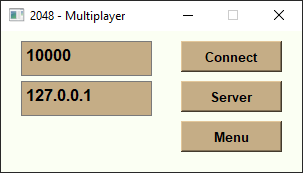
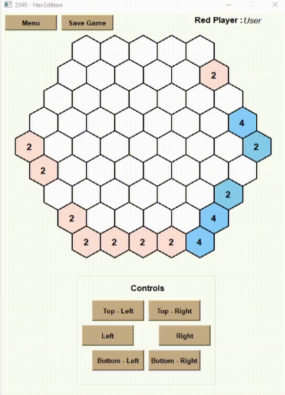

# 2048-HexEdition
## General Info
The project is a hexagonal version of popular "2048" game. It's an expanded continuation of my university project. 
The game offers singleplayer mode(versus AI based on min-max algorithm), hot-seat mode for two players and multiplayer mode which offers possibility to create server/client game instances.

## Screenshots

 Main Menu: 

 

 In-game screenshot: 

 

 Multiplayer Menu: 

 

 In-game screenshot: 

 

## Technologies used
* Python 3.6 - Main language.
* PySide2 - Python module which provides access to the complete Qt 5.12+ framework. Used for GUI design and threading.
* Socket - Python module for networking interface.

## Features
* Singleplayer mode versus AI(adjusted min-max algorithm)
* Multiplayer mode - Possibility of saving port/address configuration into a .json file
* Hot-seat mode
* Motion animations - done with multithreading
* Scoreboards
* Saving/Loading game instance to/from .xml file - live replay

## Setup
Clone the repo and install all required dependiences. Then just run "modules/main.py" 
