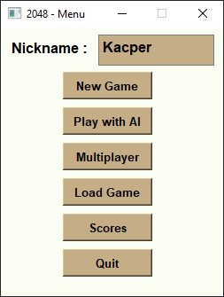

# 2048-HexEdition
## General Info
The project is a hexagonal version of popular "2048" game. It's an expanded continuation of my university project. 
The game offers singleplayer mode(versus AI based on min-max algorithm), hot-seat mode for two players and multiplayer mode which offers possibility to play by LAN.

## Screenshots

 

 

 

## Technologies used
* Python 3.6 - Main language.
* PySide2 - Python module which provides access to the complete Qt 5.12+ framework. Used for GUI design and threading.
* socket - Python module for networking interface.

## Features
* Singleplayer versus AI
* Multiplayer mode - Possibility of saving port/address configuration to a .json file
* Hot-seat mode
* Scoreboards
* Saving/Loading game instance to/from .xml file - live replay

To do:
* Movement animation

## Setup
Clone the repo, then install all required dependiences (You can do it by pip). Then just start "2048-HexEdition.py" 
